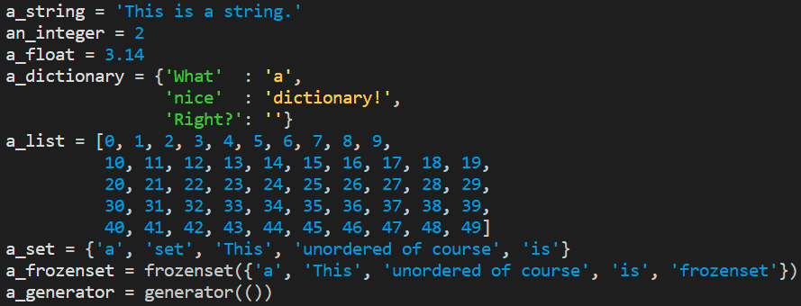

# var_print
[GitHub](https://github.com/ICreedenI/var_print) | [PyPI](https://pypi.org/project/var-print/)  

This package was inspired by [icecream](https://github.com/gruns/icecream). Please check it out if you consider installing any variable printer. Similar to icecream you can print not only the variable value but the name as well.  
At the same time the content gets nicely formated resulting in readable dictionaries, lists, tuples, sets, frozensets and generators even if they are nested.  
As a neat finish the output is colored. By default the variable name is white, the value blue, dictionary keys are green, dictionary values are yellow and the syntax is white.  
But you are not bound to this color scheme. There are a few stored in the color_schemes property of varpFore which you can choose from. But that's not the limit. You can choose the rgb code to customize the display.

## Content
- Installation
- Usage
  - Normal usage
  - Options
- Planned

## Installation
`pip install var-print`

## Usage
### Normal usage
It's pretty simple nevertheless there are many options to dig into.
To use it as is simply call varp after importing it.
```python
from var_printer import varp
x = 1
varp(x)
# prints: 
# x = 1
```
When calling varp with multiple arguments / variables they are handled one by one.
```python
a, b = 1, 2
varp(a, b)
# prints:
# a = 1
# b = 2
```
Calling them as a tuple (or list) will make a single line out of it.
```python
varp((a, b))
# prints:
# (a, b) = (1, 2)
```
For demonstration purposes, the following functions are included.
```python
varp.show_current_color_preset()
```
Result:  


```python
varp.show_a_nested_dictionary()
```
Result:  


```python
varp.show_formating_of_different_types()
```
Result:  



### Options:
- `varp.colored`  
  Set it to False to print without colors.
- `varp.deactivated`  
  Set it to True to deactivate the output or call `varp.deactivate()` / `varp.activate()`  
- `varp.name_value_sep`  
  Seperator for the variable name and the value. Default value is `' = '`.
- `varp.comma`  
  Seperator for the values of iterables. Default value is `', '`.
- `varp.prefix`  
  Prefix for all prints with varp. Default is `''` (no prefix). 
- `varp.iter_items_per_line`  
  When printing a list or other iterables, you may want to limit how many items can be printed on a line to improve readability. *Default value is 10.* Note that for better readability I chose to insert a line break after every closing dictionary, list, tuple, set, frozenset and generator.
- `varp.dict_items_per_line`  
  Should be like `varp.iter_items_per_line` but I format the lenght of every key to the max lenght of all keys to achieve better readability when printing only one item per line so you need to set `varp.dict_alignment` to `'none'` to deactivate alignment.
- `varp.dict_alignment`  
  Default value is `'left'` but you might want to choose `'right'` or `'none'`. Keys and values are aligned as wished. If `'none'` is chosen there is no alignment. Also possible is a tuple containing to values, each beeing one of the mentioned three, to set the alignment for the key and the value seperately. 
- `varp.list_alignment`  
  Same as `varp.dict_alignment` but for lists, tuples, sets, frozensets and generators and only with one value of `'left'`, `'right'` or `'none'`
- `varp.color_preset(preset)`  
  Getting different colors is as easy as calling `varp.color_preset` with the preset of your choice. There are a bunch of presets saved in `varpFore.all_presets`. Since every preset has the key 'name' you can choose a preset by name with `varpFore.get_preset_by_name(name)`. 
- `varp.show_all_color_presets`  
  Calling this function will print out every color_preset saved in `varpFore.all_presets`.
- `varp.show_current_color_preset`  
  You guessed it this shows you your current color preset.  
- `varp.save_current_color_preset`  
  Don't like the available color presets? Save your own!
- `varp.varname_rgb`  
  r, g, b code for the variable name
- `varp.name_value_sep_rgb`  
  r, g, b code for the seperator of the variable naem and the value
- `varp.value_rgb`  
  r, g, b code for the value
- `varp.comma_rgb`  
  r, g, b code for the comma (or any varp.comma string)
- `varp.prefix_rgb`  
  r, g, b code for the prefix
- `varp.dict_keys_rgb`  
  r, g, b code for the dictionary keys
- `varp.dict_vals_rgb`  
  r, g, b code for dictionary values


## Planned
I plan on adding different colors for different nesting levels and more formatting cases for numpy and what not.  
There are problems fitting the output to the terminal but as soon as I have that figured out I will add it.

